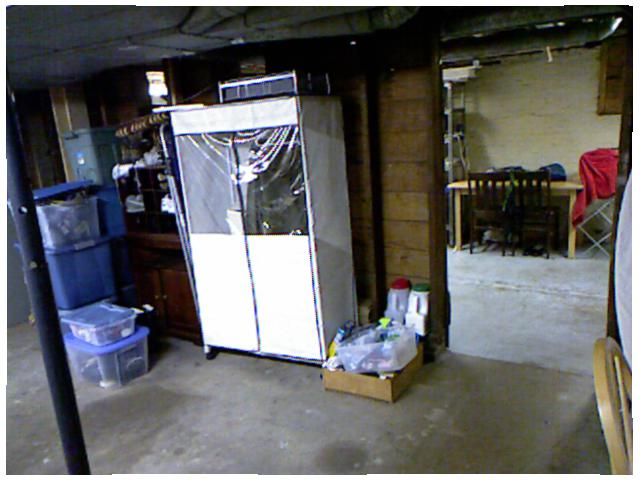
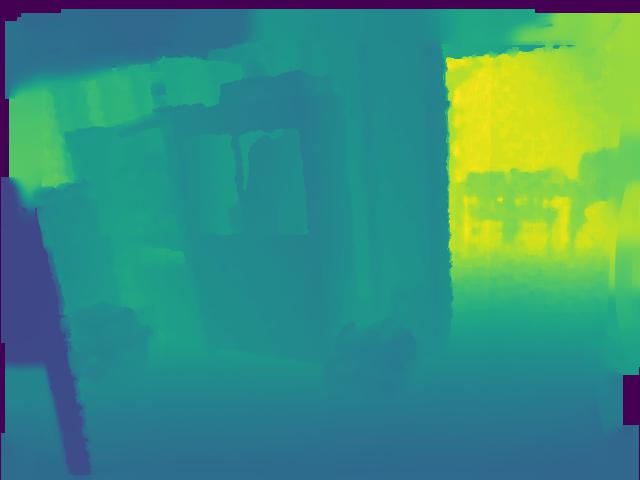

Depth Completion with Deep Neural Network
============================
## Project Goal
We aim to create a machine learning based workflow that generates dense depth information other applications from easily obtainable RGB visual information. This repo replicates and modifies the deep regression neural networks for ["Sparse-to-Dense: Depth Prediction from Sparse Depth Samples and a Single Image"](https://arxiv.org/pdf/1709.07492.pdf) by [Fangchang Ma] and [Sertac Karaman]at MIT. We mainly work on NYU-Depth V2 data set and validate the model performance.  

The model can be used to predict depth map from the following three inputs 1) RGB images only 2) sparse depth map only 2) RGB images + sparse depth map. 



## Contents
0. [Requirements](#requirements)
0. [Training](#training)
0. [Testing](#testing)
0. [Point Cloud Visualization]

## Requirements
This code was tested with Python 3 and PyTorch 0.4.0.
- Install [PyTorch](http://pytorch.org/) on a machine with CUDA GPU.
- Install the [HDF5](https://en.wikipedia.org/wiki/Hierarchical_Data_Format) and other dependencies (files in our pre-processed datasets are in HDF5 formats).
	```bash
	sudo apt-get update
	sudo apt-get install -y libhdf5-serial-dev hdf5-tools
	pip3 install h5py matplotlib imageio scikit-image opencv-python
	```
- Download NYU-Depth V2 dataset and use the mat_to_h5.py file to store them into h5 format for model training and testing. 
	
## Training
The training scripts come with several options, which can be listed with the `--help` flag. 
```bash
python3 main.py --help
```

For instance, run the following command to train a network with ResNet50 as the encoder, deconvolutions of kernel size 3 as the decoder, and both RGB and 100 random sparse depth samples as the input to the network.
```bash
python3 main.py -a resnet50 -d deconv3 -m rgbd -s 100 --data nyudepthv2
```

Training results will be saved under the `results` folder. To resume a previous training, run
```bash
python3 main.py --resume [path_to_previous_model]
```

## Testing
To test the performance of a trained model without training, simply run main.py with the `-e` option. For instance,
```bash
python3 main.py --evaluate [path_to_trained_model]
```

## Point Cloud Visualization
Use point_cloud.py file to visualize 3D point clouds from depth map. Use point_cloud_colored.py file to visualize colored 3D point clouds from RGB images and depth map


## Citation
If you use our code or method in your work, please consider citing the following:

	@article{Ma2017SparseToDense,
		title={Sparse-to-Dense: Depth Prediction from Sparse Depth Samples and a Single Image},
		author={Ma, Fangchang and Karaman, Sertac},
		booktitle={ICRA},
		year={2018}
	}
