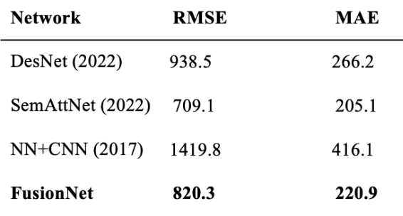

# Sparse-Depth-Completion

This repo contains the VCCV implementation of the paper [Sparse and Noisy LiDAR Completion with RGB Guidance and Uncertainty](https://arxiv.org/abs/1902.05356) by [Wouter Van Gansbeke](https://github.com/wvangansbeke), Davy Neven, Bert De Brabandere and Luc Van Gool.

```
@inproceedings{wvangansbeke_depth_2019,
    author={Van Gansbeke, Wouter and Neven, Davy and De Brabandere, Bert and Van Gool, Luc},
    booktitle={2019 16th International Conference on Machine Vision Applications (MVA)},
    title={Sparse and Noisy LiDAR Completion with RGB Guidance and Uncertainty},
    year={2019},
    pages={1-6},
    organization={IEEE}
}
```

## Introduction
FusionNet combines global and local branches for sparse LiDAR map completion, using RGB guidance to improve depth map accuracy and confidence masks to account for uncertainty during the fusion process. While the global branch captures high-level features from the sparse LiDAR images, the local branch extracts fine-graind details and both branches work together to generate proper depths. The RGB image is fused with the outputs to correct mistakes in the spares input and confidence masks further ensure the reliability. 


## Requirements
Python 3.7
The most important packages are pytorch, torchvision, numpy, pillow and matplotlib.
(Works with Pytorch 1.1)


## Dataset
The [Kitti dataset](www.cvlibs.net/datasets/kitti/) has been used. First download the dataset of the depth completion. Secondly, you'll need to unzip and download the camera images from kitti. The complete dataset consists of 85898 training samples, 6852 validation samples, 1000 selected validation samples and 1000 test samples.

## Preprocessing
The datastructure you should have before running the model is:
Dataset structure should look like this:
```
|--depth selection
|-- Depth
     |-- train
           |--date
               |--sequence1
               | ...
     |--validation
|--RGB
    |--train
         |--date
             |--sequence1
             | ...
    |--validation
```


## Run Code
To run the code:
`python main.py --data_path /path/to/data/ --lr_policy plateau`

Flags:
- Set flag "input_type" to rgb or depth.
- Set flag "pretrained" to true or false to use a model pretrained on Cityscapes for the global branch.
- See `python main.py --help` for more information.

or 

`source Shell/train.sh $datapath`

checkout more details in the bash file.

## Trained models
The model we trained is saved in the [Saved](/Saved/model_best_epoch.pth.tar) file. Test the model with the following command
`source Test/test.sh /path/to/directory_with_saved_model/ $num_samples /path/to/dataset/ /path/to/directory_with_ground_truth_for_selected_validation_files/`

## Visualization
A visualization script is provided to color the results. Run the following code to visualize:
`python3 visualize.py -s /path/to/save/visualized/img -r /path/to/results/directory/`

## Results

Comparision with state-of-the-art:

